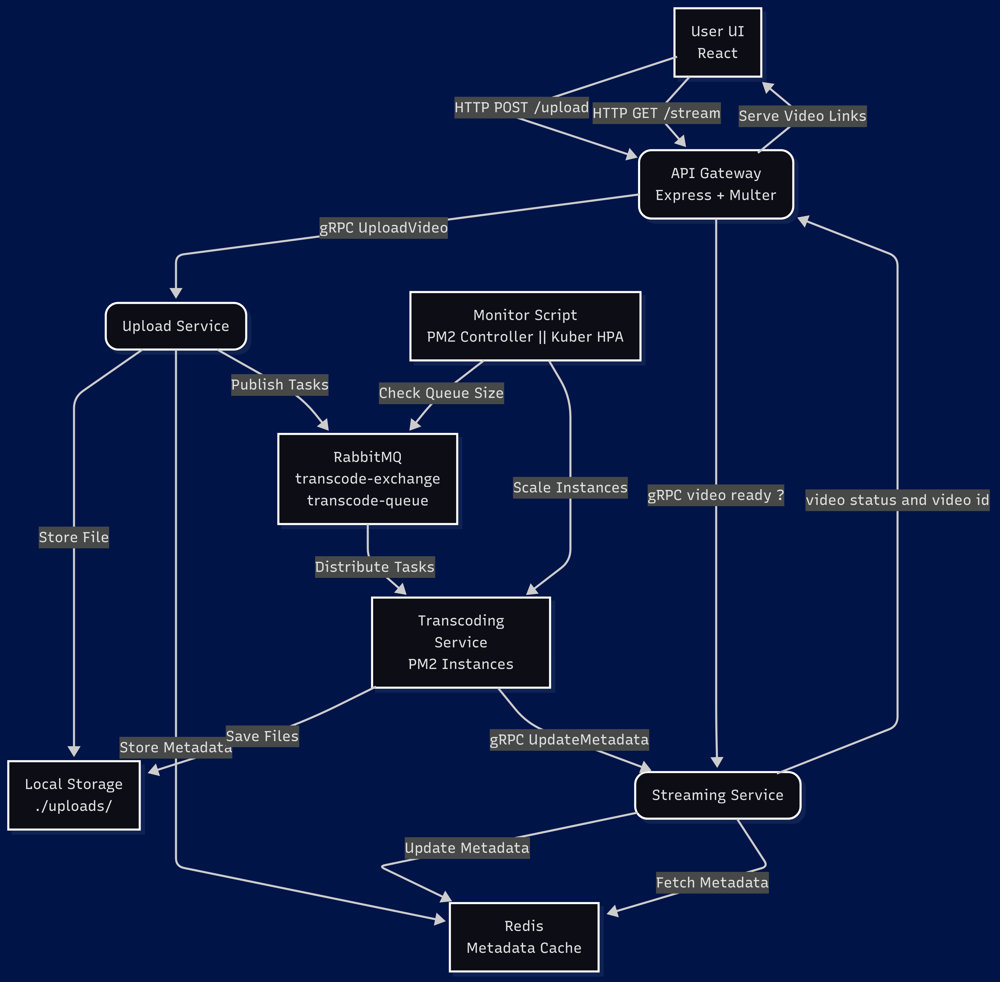

# Minimal Video Streaming System

This project is a lightweight video streaming system built with modern technologies. It allows users to upload videos via a React frontend, processes them into multiple resolutions using a microservices architecture, and streams them on demand with HLS (HTTP Live Streaming). The system uses RabbitMQ for task queuing and Redis for metadata caching, all orchestrated with Docker Compose.

## Features

- **React Frontend**: Simple UI for uploading and streaming videos using Video.js.
- **Microservices**: Upload, Transcoding, and Streaming services communicating via gRPC.
- **RabbitMQ**: Task queue for distributing transcoding jobs.
- **Redis**: Caches video metadata.
- **Local Storage**: Stores uploaded and transcoded videos.
- **Docker Compose**: Easy setup for all services.

## Architecture

The system follows this flow:

1. User uploads a video via React UI → API Gateway → Upload Service.
2. Upload Service saves the file and queues transcoding tasks in RabbitMQ.
3. Transcoding Service processes videos and updates Streaming Service.
4. User streams videos via React UI → API Gateway → Streaming Service.

---

## Prerequisites

- [Node.js](https://nodejs.org/) (v18+ recommended)
- [Docker](https://www.docker.com/) and [Docker Compose](https://docs.docker.com/compose/)
- [FFmpeg](https://ffmpeg.org/) (for transcoding, installed in the Transcoding Service Docker image)

---

## Project Structure

